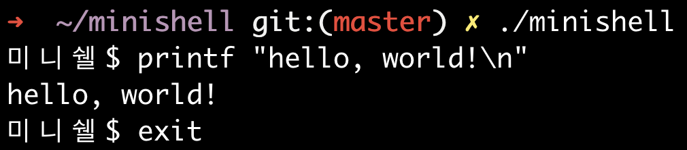

# 미니쉘 (minishell)


A little shell that mimics bash.

---

|Name|Version|
|--|--|
|**미니쉘 (minishell)**|**0.1.0**|
|macOs Catalina|10.15.7|
|GNU Readline|2.0.2|

```sh
git clone git@github.com/leeluna0476/minishell.git
cd minishell
make
./minishell
```

